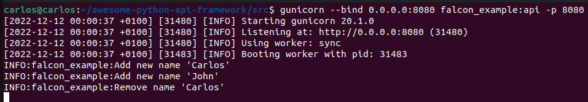
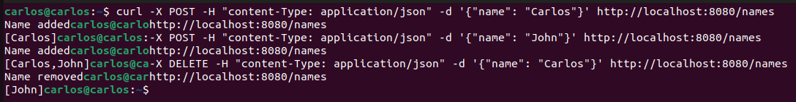

# Falcon

Table of contents

1. [Introduction](#introduction)
2. [Key Points](#key-points)
3. [Tutorial](#tutorial)
3.1. [Example](#example)

## Introduction


Falcon is a minimalist web framework for building APIs in Python. It is designed to be fast, lightweight, and flexible, allowing developers to create robust, scalable APIs with minimal overhead. Falcon is built on the WSGI standard, which means it can be used with any WSGI-compatible web server. It is also compatible with Python 3.5 and higher.

Falcon is often used for building APIs for web, mobile, and IoT applications. It is a popular choice among developers who want a fast and lightweight framework for creating scalable and maintainable APIs.

## Key points

### Pros

* Falcon has a **clean and simple API design**, making it easy to learn and use.
* It is **built on the WSGI standard**, so it can be used with any WSGI-compatible web server.
* Falcon is designed to be **fast and efficient**, with a high-performance request/response engine.
* It has **built-in support for common web standards**, such as HTTP caching, CORS, and WSGI.
* Falcon is **highly extensible**, with support for middleware, hooks, and plugins.

### Cons

* Falcon is a **minimalist framework**, so it may not have as many features and capabilities as more feature-rich frameworks.
* It has a **smaller user base and community** compared to other popular Python web frameworks.
* Falcon **does not have built-in support for many web development features**, such as template engines, form validation, and ORMs, so these must be added manually.
* It may **not be as well-suited to building web applications with complex user interfaces** and interactions compared to other web frameworks.


## Tutorial

1. Install Falcon by running the following command: `pip install falcon`

2. Create a new Python file, and import Falcon:

```python
import falcon
```

3. To create an API with `GET` and `POST` methods in Falcon, you can define resource classes that handle the `GET` and `POST` requests and return appropriate responses.

	After that, is enough with calling Falcon API constructor with `falcon.API()`.

```python
import falcon

class GreetResource:
    def on_get(self, req, resp):
        # Handle HTTP GET request and return a response
        resp.body = "Hello name"

    def on_post(self, req, resp):
        # Handle HTTP POST request and return a response
				name = req.media.get('name')
        # Do something with the user data
        resp.media = {"message": f"Hello {name}"}

api = falcon.API()
api.add_route("/users", UserResource())

```

### Example

File is located [here](https://github.com/Carlosma7/awesome-python-api-framework/blob/main/src/falcon_example.py).

```python
"""Falcon program example to show a simple configuration."""

import logging
import falcon

# Define level of logging and logger
logging.basicConfig(level=logging.INFO)
logger = logging.getLogger(__name__)

# Just for testing
global names
names = []


class NamesResource:
    """Class Handler to control all requests for names."""

    def on_get(self, req, resp):
        """GET method that returns list of names."""
        resp.body = f"[{','.join(names)}]"
        #self.write(f"[{','.join(names)}]")

    def on_post(self, req, resp):
        """POST method that adds a new name into list."""
        name = req.media.get('name')
        logger.info("Add new name '%s'", name)
        names.append(name)
        resp.body = "Name added"

    def on_delete(self, req, resp):
        """DELETE method that removes a name from the list."""
        name = req.media.get('name')
        logger.info("Remove name '%s'", name)
        names.remove(name)
        resp.body = "Name removed"


api = falcon.API()
api.add_route("/names", NamesResource())
```

Now to test it, you should just execute:

```shell
gunicorn --bind 0.0.0.0:8080 falcon_example:api
```

And you'll see the following (includes info after testing):



Now, to test it we will do a small example with:
1. **POST** a new name.
2. **GET** to see list of names.
3. **POST** another name.
4. **GET** to see updated list of names.
5. **DELETE** to remove a name.
6. **GET** to see final list of names.


