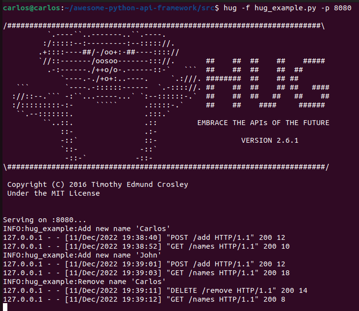
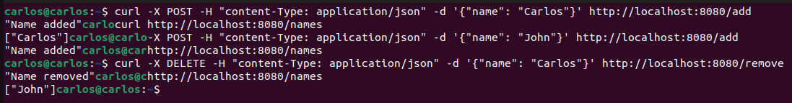

# Hug

Table of contents

1. [Introduction](#introduction)
2. [Key Points](#key-points)
2.1. [Pros](#pros)
2.2. [Cons](#cons)
3. [Tutorial](#tutorial)
3.1. [Example](#example)

## Introduction

HUG is a web framework built on top of Python's Falcon web framework that makes it easy to build, document, and test APIs. It is designed to be lightweight and flexible, allowing developers to quickly create RESTful APIs using Python. Some of the key features of HUG include automatic documentation generation, support for multiple output formats (including JSON and HTML), and a built-in testing framework. HUG is open-source and available on GitHub.

HUG is built on top of Python's Falcon web framework, which is an ASGI (Asynchronous Server Gateway Interface) framework. ASGI is a specification for web servers, application servers, and web application frameworks that allows for asynchronous, non-blocking I/O, which makes it well-suited for building highly concurrent, high-performance web applications. HUG therefore supports the ASGI specification and is not compatible with WSGI (Web Server Gateway Interface), which is a different specification for web servers and web applications.

## Key points

### Pros

* **Few features**: Since it's under development, and Hug pretends to be a simpler framework, only just a bunch of features has been implemented, and advanced configurations needs more work that other options.
* **Simplicity**: The main objective of Hug is to give the user an alternative to achieve his goals of configuring an API with a small and simple configuration.
* **Documentation**: Hug offers a great support for automatic documentation generation and also testing. They want to achieve the goal of being the less-effort needed to use it.

### Cons

* **Lack of support for advanced features**: As mentioned before, it's under development and it needs more time to reach a certain level of documentation.
* **Small community**: So help needed could sometimes not be found, as every other framework at the beginning.
* **Potential for bugs**: It's on early versions so it's up to potential bugs to happen.

## Tutorial

1. Install Hug by running the following command: `pip install hug`

2. Create a new Python file, and import Hug:

```python
import hug
```

3. Directly define the routes for the API. You can use the Hug `get` and `post` methods to define the routes:

```python
@hug.get("/hello")
def hello():
    return f"Hello, World!"
```

4. To run the Hug app, call the `hug` program with the filename:

```shell
hug -f <filename>
```

#### Get

In HUG, the `@hug.get` decorator is used to specify that a function should be called when an HTTP GET request is made to a particular URL endpoint. The `@hug.get` decorator takes a string argument that specifies the URL endpoint, and the decorated function should take zero or more arguments that correspond to the parameters in the URL endpoint.

```python
@hug.get("/hello")
def hello():
    return f"Hello, World!"
```

#### Post


In HUG, the `@hug.post` decorator is used to specify that a function should be called when an HTTP POST request is made to a particular URL endpoint. The `@hug.post` decorator takes a string argument that specifies the URL endpoint, and the decorated function should take zero or more arguments that correspond to the parameters in the request body.

If the request body contains JSON data, you can use the `hug.body_` argument to access the parsed JSON data. This argument is a dictionary-like object that contains the key-value pairs from the JSON data.

```python
import hug

@hug.post("/hello")
def hello(body_: hug.types.json):
    name = body_["name"]
    return f"Hello, {name}!"`
```

### Example

File is located [here](https://github.com/Carlosma7/awesome-python-api-framework/blob/main/src/hug_example.py).

```python
"""Hug program example to show a simple configuration."""

import logging
import hug

# Define level of logging and logger
logging.basicConfig(level=logging.INFO)
logger = logging.getLogger(__name__)

# Just for testing
global names
names = []

# GET method: curl http://localhost:8080/names
@hug.get('/names')
def get_names():
    """GET method that returns list of names."""
    return names


# POST method: curl -X POST -H "content-Type: application/json"
# -d '{"name": "Carlos"}' http://localhost:8080/add
@hug.post('/add')
def add_name(name: hug.types.text):
    """POST method that adds a new name into list."""
    logger.info("Add new name '%s'", name)
    names.append(name)

    return 'Name added'


# DELETE method: curl -X DELETE -H "content-Type: application/json"
# -d '{"name": "Carlos"}' http://localhost:8080/remove
@hug.delete('/remove')
def remove_name(name: hug.types.text):
    """DELETE method that removes a name from the list."""
    logger.info("Remove name '%s'", name)
    names.remove(name)

    return 'Name removed'
```

Now to test it, you should just execute:

```shell
hug -f hug_example.py -p 8080
```

And you'll see the following (includes info after testing):



Now, to test it we will do a small example with:
1. **POST** a new name.
2. **GET** to see list of names.
3. **POST** another name.
4. **GET** to see updated list of names.
5. **DELETE** to remove a name.
6. **GET** to see final list of names.


