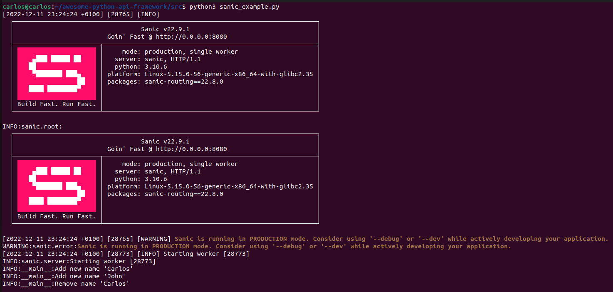
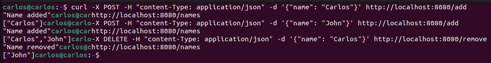

# Sanic

Table of contents

1. [Introduction](#introduction)
2. [Key Points](#key-points)
2.1. [Pros](#pros)
2.2. [Cons](#cons)
3. [Tutorial](#tutorial)
3.1. [Example](#example)

## Introduction

Sanic is a web framework for Python. It is known for its speed and is intended for building fast, scalable web applications. Sanic allows you to create web servers and APIs using asynchronous programming, which can make your application more efficient and allow it to handle a higher load. If you're familiar with Flask, a popular web framework for Python, Sanic is similar but offers better performance.

Sanic is designed to work with the ASGI (Asynchronous Server Gateway Interface) specification. ASGI is a specification for building asynchronous web applications in Python, similar to WSGI (Web Server Gateway Interface), which is the standard for building synchronous web applications in Python. Sanic is built to take advantage of the features of ASGI, such as asynchronous request handling and support for websockets, to provide fast and efficient performance.

## Key points

### Pros

* **Speed**: Sanic is known for its fast performance, and it is designed to handle a high number of requests per second.
* **Asynchronous programming**: Sanic is built on top of asyncio, the Python library for asynchronous programming. This allows Sanic to handle requests in an asynchronous manner, which can make your application more efficient and allow it to handle a higher load.
* **Flexibility**: Sanic is a lightweight framework, so you have a lot of flexibility in how you use it. You can use it to build a wide range of web applications, from simple APIs to complex, real-time applications.

### Cons

* **Lack of community support**: Sanic is a relatively new framework, so it doesn't have as much support from the Python community as some of the more established frameworks. This means that there may be fewer resources available for learning and troubleshooting.
* **Limited features**: Because Sanic is a lightweight framework, it doesn't have as many built-in features as some of the more full-featured frameworks. This means that you may need to build some features yourself, or use third-party libraries to add them to your application.
* **Asynchronous programming**: While asynchronous programming can provide benefits in terms of performance, it can also make your code more complex and difficult to understand. If you're new to asynchronous programming, using Sanic may require a steeper learning curve.


## Tutorial

1. Install Sanic by running the following command: `pip install sanic`

2. Create a new Python file, and import Sanic:

```python
from sanic import Sanic
```

3. Next, create a new Sanic app by calling the Sanic constructor:

```python
app = Sanic()
```

4. Now that you have a Sanic app, you can define routes that can be accessed by users. A route is a URL pattern that the Sanic app responds to, and a function that is called when that route is accessed. To define a route, use the `@app.route` decorator and specify the URL pattern as the first argument. The function that will be called when that route is accessed is the argument to the decorator. For example:

```python
@app.route("/hello")
async def hello(request):
    return response.json({"message": "Hello, world!"})
```

5. To run the Sanic app, call the `run()` method of the Sanic app object, and specify the host and port on which the app should run:

```python
if __name__ == '__main__':
    app.run(host='0.0.0.0', port=8080)
```

#### Get

The `get` method is used in the Sanic web framework to handle HTTP GET requests. This method is called when a client, such as a web browser, sends an HTTP GET request to the server. In Sanic, the `get` method takes a URL pattern as its first argument and a handler function as its second argument. The handler function is called when the server receives an HTTP GET request with a URL that matches the specified pattern.

```python
@app.get("/hello")
async def hello(request):
    return json({"hello": "world"})
```

#### Post

The `post` method is used in the Sanic web framework to handle HTTP POST requests. This method is called when a client, such as a web browser, sends an HTTP POST request to the server with a JSON payload in the request body. In Sanic, the `post` method takes a URL pattern as its first argument and a handler function as its second argument. The handler function is called when the server receives an HTTP POST request with a URL that matches the specified pattern and a JSON payload in the request body.

```python
@app.post("/users")
async def create_user(request):
    user_data = request.json
    # Process the user data and create a new user
    return json({"message": "User created successfully"})
```

Note that you need to import the `sanic.response` object from Sanic in order to access the `json` attribute, like this:

```python
from sanic.response import json
```

### Example

File is located [here](https://github.com/Carlosma7/awesome-python-api-framework/blob/main/src/sanic_example.py).

```python
"""Sanic program example to show a simple configuration."""

import logging
from sanic import Sanic
from sanic.response import json

# Define sanic app
app = Sanic(__name__)

# Define level of logging and logger
logging.basicConfig(level=logging.INFO)
logger = logging.getLogger(__name__)


# GET method: curl http://localhost:8080/names
@app.get('/names')
async def get_names(request):
    """GET method that returns list of names."""
    return json(names)


# POST method: curl -X POST -H "content-Type: application/json"
# -d '{"name": "Carlos"}' http://localhost:8080/add
@app.post('/add')
async def add_name(request):
    """POST method that adds a new name into list."""
    name = request.json.get('name')

    logger.info("Add new name '%s'", name)
    names.append(name)

    return json('Name added')


# DELETE method: curl -X DELETE -H "content-Type: application/json"
# -d '{"name": "Carlos"}' http://localhost:8080/remove
@app.delete('/remove', ignore_body=False)
async def remove_name(request):
    """DELETE method that removes a name from the list."""
    name = request.json.get('name')

    logger.info("Remove name '%s'", name)
    names.remove(name)

    return json('Name removed')


if __name__ == '__main__':
    names = []
    app.run(host='0.0.0.0', port=8080)
```

Now to test it, you should just execute:

```shell
python3 sanic_example.py
```

And you'll see the following (includes info after testing):



Now, to test it we will do a small example with:
1. **POST** a new name.
2. **GET** to see list of names.
3. **POST** another name.
4. **GET** to see updated list of names.
5. **DELETE** to remove a name.
6. **GET** to see final list of names.



