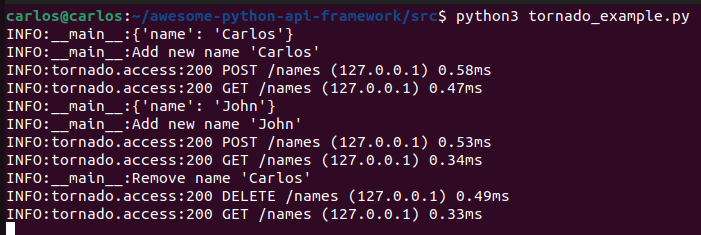
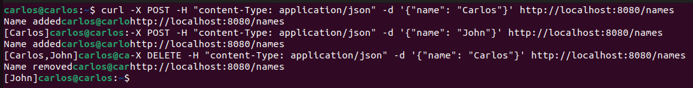

# Tornado

Table of contents

1. [Introduction](#introduction)
2. [Key Points](#key-points)
3. [Tutorial](#tutorial)
3.1. [Example](#example)

## Introduction


Tornado is a Python web framework and asynchronous networking library. It is designed to handle large amounts of traffic and to provide a high-performance web server for applications that require a non-blocking, event-driven architecture.

Tornado is built on top of the asyncio library, which provides an efficient and scalable event loop for asynchronous programming in Python. This allows Tornado to handle multiple requests concurrently using a single thread, reducing the overhead and complexity associated with traditional multi-threaded web servers.

Tornado includes many features that are commonly found in web frameworks, such as routing, template rendering, and support for third-party authentication and authorization systems. It also includes a web server, which can be used to serve static and dynamic content, as well as a web socket implementation for real-time communication between clients and servers.

Overall, Tornado is a powerful and versatile tool for building high-performance web applications in Python.

## Key points

### Pros

* **High performance**: Tornado is built on top of the asyncio library, which provides an efficient and scalable event loop for asynchronous programming. This allows Tornado to handle a large number of concurrent connections with a single thread, making it a good choice for high-traffic applications.
* **Asynchronous programming support**: Tornado provides native support for asynchronous programming, which allows you to write non-blocking, event-driven code that can perform multiple operations concurrently. This can help improve the overall performance and scalability of your applications.
* **Web server and web socket support**: Tornado includes a built-in web server and a web socket implementation, which can be used to serve static and dynamic content, as well as enable real-time communication between clients and servers.
* **Flexibility and extensibility**: Tornado is designed to be flexible and extensible, and it provides many features that are commonly found in web frameworks, such as routing, template rendering, and support for third-party authentication and authorization systems.

### Cons

* **Asynchronous programming** can be challenging: Asynchronous programming is a powerful and efficient approach, but it can also be complex and difficult to learn, especially for developers who are new to the concept. This can make it more challenging to develop applications with Tornado compared to other web frameworks that use a more traditional, synchronous programming model.
* **Limited community and ecosystem**: Because Tornado is a relatively niche framework, it has a smaller community and ecosystem compared to other popular Python web frameworks such as Flask and Django. This can make it more difficult to find support and resources, and it may also limit the availability of third-party libraries and tools.
* **Limited compatibility with other libraries and frameworks**: Due to its asynchronous programming model and other design choices, Tornado is not always compatible with other libraries and frameworks that use a different programming model. This can make it more challenging to integrate Tornado with existing code or to use it in conjunction with other tools and libraries.

## Tutorial

1. Install Tornado by running the following command: `pip install tornado`

2. Create a new Python file, and import Tornado. To create an API with Tornado, you can use the `tornado.web.Application` class to define the API's routes and behavior. This class provides methods that can be used to handle HTTP requests and return responses to the client.

	To create the web server and start the API, you can use the `tornado.web.HTTPServer` class and the `tornado.ioloop.IOLoop` class.

```python
import tornado.web
import tornado.httpserver
import tornado.ioloop
```

3. To create a simple API with Tornado that supports both HTTP GET and POST requests, you can use the `tornado.web.Application` class to define the API's routes and behavior, as well as the `tornado.web.RequestHandler` class to define the handler methods for each type of request.

	Here is an example of how to create a simple API with Tornado that supports both GET and POST requests:

```python
import tornado.web

class GreetHandler(tornado.web.RequestHandler):
    def get(self):
        name = self.get_argument("name")
        self.write(f"Hello, {name}!")

    def post(self):
        data = self.request.body
        self.write(f"Received the following data: {data}")

app = tornado.web.Application([
    (r"/greet", GreetHandler),
])
```

### Example

File is located [here](https://github.com/Carlosma7/awesome-python-api-framework/blob/main/src/tornado_example.py).

```python
"""Tornado program example to show a simple configuration."""

import logging
import json
import tornado.web
import tornado.httpserver
import tornado.ioloop

# Define level of logging and logger
logging.basicConfig(level=logging.INFO)
logger = logging.getLogger(__name__)

# Just for testing
global names
names = []


class NamesHandler(tornado.web.RequestHandler):
    """Class Handler to control all requests for names."""

    def get(self):
        """GET method that returns list of names."""
        self.write(f"[{','.join(names)}]")

    def post(self):
        """POST method that adds a new name into list."""
        data = json.loads(self.request.body.decode())
        logger.info(data)
        name = data.get('name')
        logger.info("Add new name '%s'", name)
        names.append(name)
        self.write("Name added")

    def delete(self):
        """DELETE method that removes a name from the list."""
        data = json.loads(self.request.body.decode())
        name = data.get('name')
        logger.info("Remove name '%s'", name)
        names.remove(name)
        self.write("Name removed")


app = tornado.web.Application([
    (r"/names", NamesHandler),
])

server = tornado.httpserver.HTTPServer(app)
server.listen(8080)
tornado.ioloop.IOLoop.current().start()
```

Now to test it, you should just execute:

```shell
python3 tornado_example.py
```

And you'll see the following (includes info after testing):



Now, to test it we will do a small example with:
1. **POST** a new name.
2. **GET** to see list of names.
3. **POST** another name.
4. **GET** to see updated list of names.
5. **DELETE** to remove a name.
6. **GET** to see final list of names.



